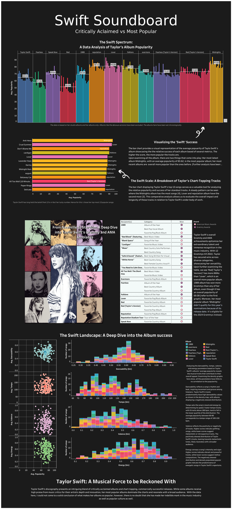

# Tableau-Viz
Taylor Swift Popularity 
My first tableau project on Tableau and I did an anlysis on all her studio albums to understand her popular albums/songs vs critically acclaimed. I used [Spotify dataset](https://www.kaggle.com/datasets/jarredpriester/taylor-swift-spotify-dataset) as my dataset.

